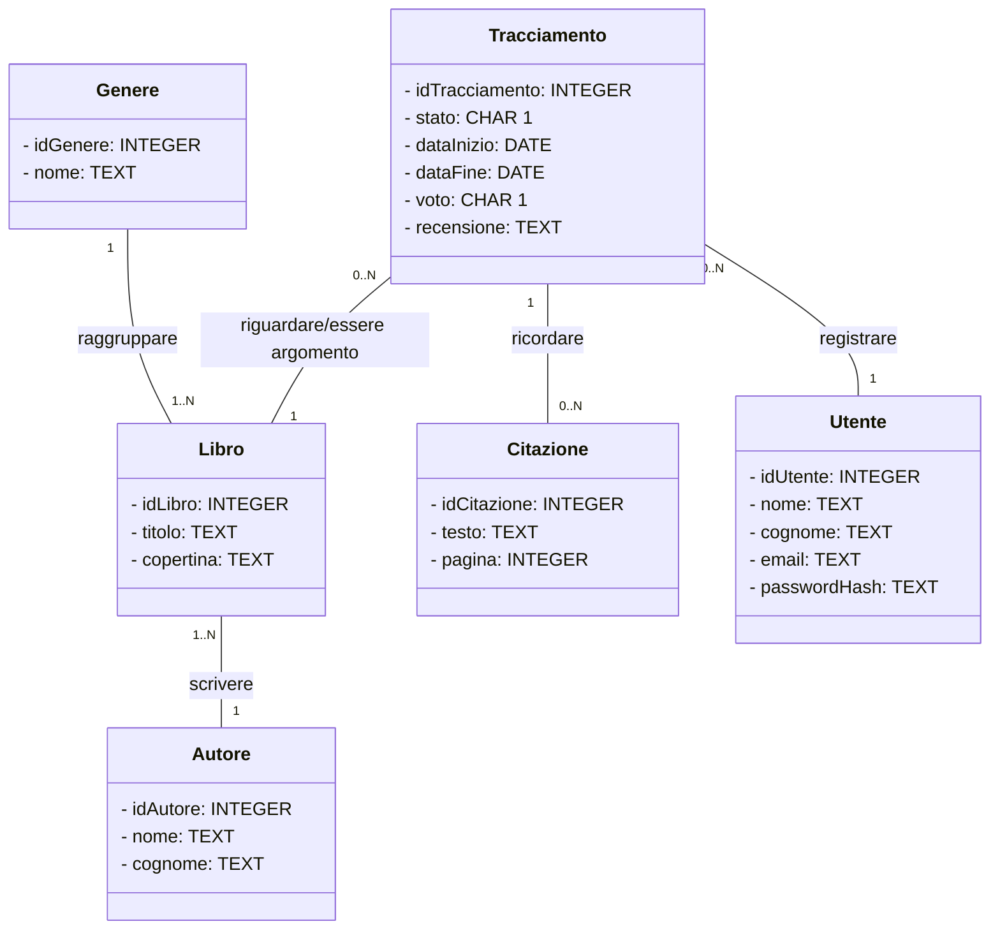

# Memoriae Librorum

**main goal**: creare un sito web che permetta di tener traccia dei libri letti, in lettura e da leggere.

## Dalla realtà al livello fisico

### Analisi

L'utente dovrà registrarsi nella piattaforma, accettando termini e condizioni.

Ogni utente è caratterizzato da:

- il codice identificativo univoco
- il nome
- il cognome
- l'email
- la password

L'email è univoca per ogni utente, in quanto non possono esistere due account con la stessa email. La password verrà criptata con algoritmi efficienti e salvata in modo sicuro nel database.

Nella dashboard, un utente può aggiungere più libri, caratterizzati da:

- il codice identificativo univoco
- il titolo
- un percorso della copertina
- l'autore di riferimento
- il genere di riferimento

Potrebbe capitare che un libro non abbia una copertina (libro antico trasandato) o che non si sia ancora caricata nel server, di conseguenza non è necessario il suo inserimento.
Ci possono essere libri con lo stesso titolo, ma non libri con lo stesso titolo e lo stesso autore in quanto sarebbero duplicati.
Da quanto accordato a seguito di un colloquio con dei lettori, la funzionalità del tracciamento delle pagine è superfluo e poco utile, in quanto preferiscono tenere il progresso col segnalibro. Inoltre, per semplificare la gestione non vengono inserite le case editrici, le quali fanno versioni di libri diverse e determinarle tutte sarebbe troppo complicato.

Ogni libro deve essere scritto da un autore principale, salvato separatamente e caratterizzato da:

- il codice identificativo univoco
- un nome
- un cognome

Il libro potrebbe essere antico e si potrebbe non conoscere il suo autore, perciò l'inserimento del nome e del cognome non è obbligatorio: dell'autore sconosciuto si salverà solo il codice.

Ogni libro può essere raggruppato da un genere letterario principale, salvato separatamente e caratterizzato da:

- il codice identificativo univoco
- il nome del genere

Tuttavia, più utenti possono leggere lo stesso libro, perciò si registrano a parte i tracciamenti del singolo utente sul singolo libro. Ogni tracciamento è caratterizzato da:

- il codice identificativo univoco
- lo stato (1: in lettura, 2: da leggere, 3: completato)
- una data inizio lettura (dd/mm/yyyy)
- una data fine lettura (dd/mm/yyyy)
- un voto (da 1 a 5)
- una recensione
- il libro di riferimento
- l'utente di riferimento

Le date di inizio e fine lettura sono facoltative in quanto il libro potrebbe essere ancora da leggere o in stato di lettura, e quindi l'inserimento delle date non può essere eseguito. Stessa cosa vale pure per il voto e la recensione.
Verrà eseguito un controllo sulle date in base allo stato di avanzamento della lettura.
Il tracciamento riguarda obbligatoriamente un libro salvato nel database e deve essere registrata per forza da un utente valido.

Per ogni libro, l'utente può scrivere delle citazioni, caratterizzate da:

- il codice identificativo univoco
- il testo
- la pagina in cui si trova la citazione
- il tracciamento di riferimento

La citazione può essere aggiunta solo una volta aver registrato il tracciamento.
La citazione non può esistere senza il suo testo e la pagina in cui si trova, perciò l'inserimento è obbligatorio.

### Livello Concettuale: Class Diagram



#### Regole di lettura

1. Ogni Utente può registrare uno o più Tracciamenti.
2. Ogni Tracciamento deve essere registrato da un solo Utente.
3. Ogni Citazione deve ricordare un solo Tracciamento.
4. Ogni Tracciamento può essere ricordato da una o più Citazioni.
5. Ogni Tracciamento deve riguardare un solo Libro.
6. Ogni Libro può essere argomento di uno o più Tracciamenti.
7. Ogni Genere deve raggruppare uno o più Libri.
8. Ogni Libro deve essere raggruppato da un solo Genere.
9. Ogni Autore deve scrivere uno o più Libri.
10. Ogni Libro deve essere stato scritto da un solo Autore.

### Livello Logico: Tracciati Record

#### tblUtenti

| Nome campo   | Tipo    | Formato             | Richiesto | Duplicati ammessi | Chiave    | Descrizione                          |
|--------------|---------|---------------------|-----------|-------------------|-----------|--------------------------------------|
| idUtente     | INTEGER | XYZ                 | Sì        | No                | Primaria  | Identificativo univoco dell'utente   |
| nome         | TEXT    | Abc                 | Sì        | Sì                | -         | Nome dell'utente                     |
| cognome      | TEXT    | Abc                 | Sì        | Sì                | -         | Cognome dell'utente                  |
| email        | TEXT    | <email@dominio.com> | Sì        | No                | -         | Email univoca per ogni utente        |
| passwordHash | TEXT    | Stringa criptata    | Sì        | Sì                | -         | Password salvata in modo sicuro      |

#### tblLibri

| Nome campo | Tipo    | Formato      | Richiesto | Duplicati ammessi | Chiave    | Descrizione                             |
|------------|---------|--------------|-----------|-------------------|-----------|-----------------------------------------|
| idLibro    | INTEGER | XYZ          | Sì        | No                | Primaria  | Identificativo univoco del libro        |
| titolo     | TEXT    | Abc          | Sì        | Sì                | -         | Titolo del libro                        |
| copertina  | TEXT    | abc/abc/a.bc | No        | Sì                | -         | Percorso dell'immagine di copertina     |
| autoreId   | INTEGER | XYZ          | Sì        | Sì                | Esterna   | Autore principale (collegato ad Autore) |
| genereId   | INTEGER | XYZ          | Sì        | Sì                | Esterna   | Genere principale (collegato a Genere)  |

#### tblAutori

| Nome campo | Tipo    | Formato  | Richiesto | Duplicati ammessi | Chiave    | Descrizione                            |
|------------|-------- |----------|-----------|-------------------|-----------|----------------------------------------|
| idAutore   | INTEGER | XYZ      | Sì        | No                | Primaria  | Identificativo univoco dell'autore     |
| nome       | TEXT    | Abc      | No        | Sì                | -         | Nome dell'autore (facoltativo)         |
| cognome    | TEXT    | Abc      | No        | Sì                | -         | Cognome dell'autore (facoltativo)      |

#### tblGeneri

| Nome campo | Tipo    | Formato  | Richiesto | Duplicati ammessi | Chiave    | Descrizione                           |
|------------|---------|----------|-----------|-------------------|-----------|---------------------------------------|
| idGenere   | INTEGER | XYZ      | Sì        | No                | Primaria  | Identificativo univoco del genere     |
| nome       | TEXT    | abc      | Sì        | No                | -         | Nome del genere letterario            |

#### tblTracciamenti

| Nome campo     | Tipo    | Formato    | Richiesto | Duplicati ammessi | Chiave    | Descrizione                                              |
|----------------|---------|------------|-----------|-------------------|-----------|----------------------------------------------------------|
| idTracciamento | INTEGER | XYZ        | Sì        | No                | Primaria  | Identificativo univoco del tracciamento                  |
| stato          | CHAR    | 1, 2, 3    | Sì        | Sì                | -         | Stato del libro (1: in lettura, 2: da leggere, 3: letto) |
| dataInizio     | DATE    | dd/mm/yyyy | No        | Sì                | -         | Data di inizio lettura                                   |
| dataFine       | DATE    | dd/mm/yyyy | No        | Sì                | -         | Data di fine lettura                                     |
| voto           | CHAR    | 1-5        | No        | Sì                | -         | Voto assegnato al libro                                  |
| recensione     | TEXT    | abc        | No        | Sì                | -         | Recensione dell'utente                                   |
| libroId        | INTEGER | XYZ        | Sì        | Sì                | Esterna   | Libro di riferimento (collegato a Libro)                 |
| utenteId       | INTEGER | XYZ        | Sì        | Sì                | Esterna   | Utente che ha effettuato il tracciamento                 |

#### tblCitazioni

| Nome campo     | Tipo    | Formato  | Richiesto | Duplicati ammessi | Chiave    | Descrizione                                            |
|----------------|---------|----------|-----------|-------------------|-----------|--------------------------------------------------------|
| idCitazione    | INTEGER | XYZ      | Sì        | No                | Primaria  | Identificativo univoco della citazione                 |
| testo          | TEXT    | abc      | Sì        | Sì                | -         | Testo della citazione                                  |
| pagina         | INTEGER | XYZ      | Si        | Sì                | -         | Numero della pagina                      |
| tracciamentoId | INTEGER | XYZ      | Sì        | Sì                | Esterna   | Tracciamento di riferimento (collegato a Tracciamento) |

#### DDL

Le tabelle del database e le relative associazioni sono create attraverso le seguenti query DDL:

```SQL
CREATE TABLE IF NOT EXISTS tblUtenti(
  idUtente INTEGER PRIMARY KEY AUTO_INCREMENT,
  nome TEXT NOT NULL,
  cognome TEXT NOT NULL,
  email TEXT NOT NULL UNIQUE,
  passwordHash TEXT NOT NULL
);

CREATE TABLE IF NOT EXISTS tblAutori(
  idAutore INTEGER PRIMARY KEY AUTO_INCREMENT,
  nome TEXT NOT NULL,
  cognome TEXT NOT NULL
);

CREATE TABLE IF NOT EXISTS tblGeneri(
  idGenere INTEGER PRIMARY KEY AUTO_INCREMENT,
  nome TEXT NOT NULL
);

CREATE TABLE IF NOT EXISTS tblLibri(
  idLibro INTEGER PRIMARY KEY AUTO_INCREMENT,
  titolo TEXT NOT NULL,
  copertina TEXT,
  genereId INTEGER NOT NULL,
  autoreId INTEGER NOT NULL,
  FOREIGN KEY (genereId) REFERENCES tblGeneri(idGenere),
  FOREIGN KEY (autoreId) REFERENCES tblAutori(idAutore)
);

CREATE TABLE IF NOT EXISTS tblTracciamenti(
  idTracciamento INTEGER PRIMARY KEY AUTO_INCREMENT,
  stato CHAR(1) NOT NULL,
  dataInizio DATE,
  dataFine DATE,
  voto CHAR(1),
  recensione TEXT,
  libroId INTEGER NOT NULL,
  utenteId INTEGER NOT NULL,
  FOREIGN KEY (libroId) REFERENCES tblLibri(idLibro),
  FOREIGN KEY (utenteId) REFERENCES tblUtenti(idUtente)
);

CREATE TABLE IF NOT EXISTS tblCitazioni(
  idCitazione INTEGER PRIMARY KEY AUTO_INCREMENT,
  testo TEXT NOT NULL,
  pagina INTEGER NOT NULL,
  tracciamentoId INTEGER NOT NULL,
  FOREIGN KEY (tracciamentoId) REFERENCES tblTracciamenti(idTracciamento)
);
```

## Analisi dei requisiti

- **lato utente**:
  - deve registrarsi e deve poter accedere alla propria dashboard.
    - per registrarsi occorre nome, cognome, email e password.
    - per accedere occorre email e password.
      - non ci sono interazioni tra utenti: ogni utente potrà vedere soltanto la propria dashboard.
      - per le normative GDPR l'utente ha il diritto di poter vedere e modificare i propri dati e di richiedere la cancellazione in qualsiasi momento.
  - pagina profilo:
    - nella pagina del profilo, l'utente avrà la possibilià di vedere tutti i suoi dati, modificare nome, cognome, email e password, e cancellare il suo profilo dal database.
    - la prima pagina mostrerà tutti i suoi dati e avrà la possibilità di modificarli, inclusa la password (specificando la vecchia password) e cancellare il profilo confermando con la password.
  - dashboard utente:
    - deve poter aggiungere libri nella propria dashboard cercando per Titolo nella barra di ricerca dinamica.
    - Una volta cercato apparirà un dropdown dei risultati e si potra aggiungere il libro attraverso un pulsante. Il libro appena aggiunto verrà visualizzato nella parte relativa ai libri da leggere (si presuppone che uno aggiunga pian piano i libri che deve leggere): l'utente potrà poi modificare i dati del tracciamento relativo per spostarelo in altri stati di lettura.
    - Dopo l'aggiunta, l'utente può decidere di cercare altri libri e aggiungerli alla propria dashboard
    - Nella dashboard, l'utente potrà vedere ogni libro aggiunto (per ogni libro una tessera con il titolo, l'autore)
      - avrà la possibilità di cliccare su un bottone per ogni libro salvato per vedere la pagina web specifica del tracciamento.
      - Per ogni pagina web specifica del tracciamento, l'utente può vedere (e non saranno modificabili): copertina del libro, titolo del libro, autore (nome e cognome), genere. E potrà aggiugere e modificare le caratteristiche pertinenti alla sua attività di tracking, cioè: stato di avanzamento, data inizio e fine lettura, voto e recensione.
        - la prima pagina mostrerà tutti i dati di tracking del libro e due bottoni: modifica dati tracking e cancella libro dal tracking (dai tracciamenti).
        - se si preme il bottone modifica si reindiriza l'utente a una pagina in cui tutti i dati modificabili del tracciamento sono presenti dentro delle caselle di testo se sono già state salvate precedentemente; altrimenti avrà la possibilità di inizializzare il primo salvataggio del tracciamento. L'utente potrà modificare e salvare i dati con un bottone.
        - Inoltre, sempre nella pagina di modifica, deve avere la possibilità di aggiungere e cancellare citazioni attraverso due caselle (una per il testo e una per la pagina) e un bottone per aggiungere
          - Nella stessa pagina, per ogni riga che visualizza una citazione, ci sarà per ugnuna un bottone di cancellazione della citazione, che andrà a cancellare il record dal database.
  - deve avere la possibilità di abilitare la modalità scura.
